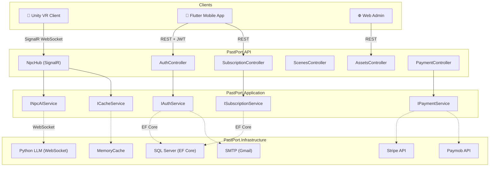
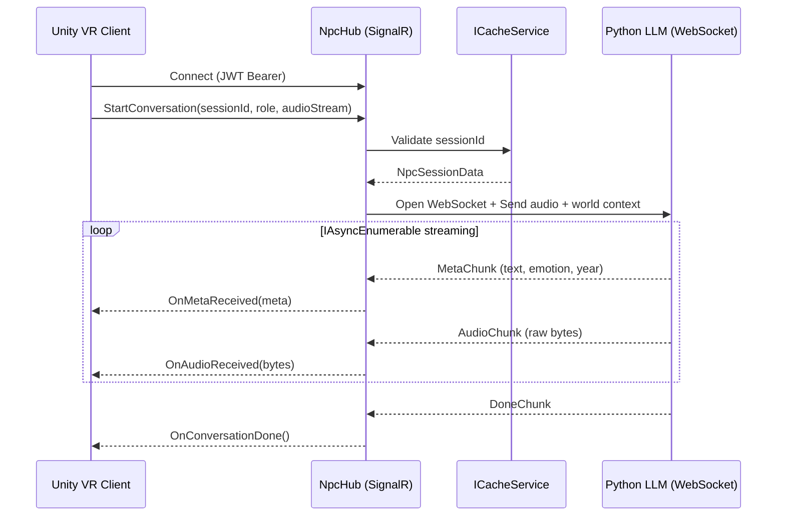

<p align="center">
  
</p>

<h1 align="center">PastPort Backend API</h1>

<p align="center">
  <strong>The server-side engine powering PastPort — an immersive Virtual Reality platform for historical exploration.</strong>
</p>

<p align="center">
  <a href="https://dotnet.microsoft.com/"></a>
  <a href="#"></a>
  <a href="#"></a>
  <a href="#"></a>
</p>

---

## Table of Contents

- [Overview](#overview)
- [Key Features](#key-features)
- [Technology Stack](#technology-stack)
- [Architecture](#architecture)
- [Project Structure](#project-structure)
- [Getting Started](#getting-started)
  - [Prerequisites](#prerequisites)
  - [Installation](#installation)
  - [Configuration](#configuration)
  - [Running the Application](#running-the-application)
  - [Running Migrations](#running-migrations)
- [API Reference](#api-reference)
  - [Authentication](#authentication)
  - [User Management](#user-management)
  - [Historical Scenes & Characters](#historical-scenes--characters)
  - [NPC AI Interaction](#npc-ai-interaction)
  - [Asset Management](#asset-management)
  - [Subscriptions & Payments](#subscriptions--payments)
- [Real-Time Communication](#real-time-communication)
- [Security](#security)
- [Environment Configuration](#environment-configuration)
- [Testing](#testing)
- [Deployment](#deployment)
- [Team](#team)
- [License](#license)

---

## Overview

**PastPort** is a Virtual Reality historical experience platform that lets users explore reconstructed ancient civilizations, interact with AI-powered historical characters via voice, and manage 3D scene assets — all backed by a modern, production-grade .NET backend.

This repository contains the **backend API** — a **.NET 9 Clean Architecture** solution that serves:

| Client        | Integration Method                           |
| ------------- | -------------------------------------------- |
| **Unity VR**  | SignalR WebSocket hub for real-time NPC audio |
| **Flutter**   | RESTful API for auth, sessions, and billing  |
| **Web Admin** | REST + Swagger UI for content management     |

---

## Key Features

| Domain                   | Capability                                                                                    |
| ------------------------ | --------------------------------------------------------------------------------------------- |
| 🔐 **Authentication**    | JWT + Refresh Tokens, Email Verification, Password Reset, Google / Facebook / Apple OAuth      |
| 🏛️ **Scene Management** | CRUD for historical scenes with era, location, and environment prompts                        |
| 🎭 **Character Engine**  | Manage NPC characters with personality, background, voice IDs, and avatar URLs                |
| 🤖 **AI NPC Streaming**  | Real-time voice conversation via SignalR → Python LLM WebSocket, with `IAsyncEnumerable` flow |
| 📦 **Asset Pipeline**    | Upload, hash (SHA-256), version, search, and deliver 3D assets to Unity clients               |
| 💳 **Subscriptions**     | Plan management, checkout flow, Stripe + Paymob webhooks, feature-gated access                |
| 🛡️ **Security**         | Rate limiting, HMAC webhook validation, `[Authorize]` enforcement, global exception handling  |
| 📊 **Observability**     | Structured logging with Serilog, health-check endpoint, ISO 8601 error timestamps             |

---

## Technology Stack

| Layer              | Technology                                                                             |
| ------------------ | -------------------------------------------------------------------------------------- |
| **Runtime**        | [.NET 9.0](https://dotnet.microsoft.com/) / ASP.NET Core                               |
| **ORM**            | [Entity Framework Core](https://learn.microsoft.com/en-us/ef/core/) 8+                 |
| **Database**       | SQL Server                                                                             |
| **Caching**        | `IMemoryCache` via `ICacheService` abstraction                                         |
| **Real-Time**      | [SignalR](https://learn.microsoft.com/en-us/aspnet/core/signalr/) (WebSocket transport) |
| **Authentication** | ASP.NET Core Identity + JWT Bearer                                                     |
| **Object Mapping** | [Mapster](https://github.com/MapsterMapper/Mapster)                                    |
| **Logging**        | [Serilog](https://serilog.net/) (console + file sinks)                                 |
| **Payments**       | Stripe SDK, Paymob HMAC webhooks                                                      |
| **Email**          | SMTP (Gmail) via `IEmailService`                                                       |
| **Rate Limiting**  | `AspNetCoreRateLimit`                                                                  |

---

## Architecture

PastPort follows **Clean Architecture** (also known as Onion Architecture), enforcing strict dependency inversion between layers:

```
┌──────────────────────────────────────────────────────────┐
│                    PastPort.API                           │
│  Controllers · Hubs · Middleware · Filters · Extensions  │
├──────────────────────────────────────────────────────────┤
│                 PastPort.Application                      │
│    Interfaces · DTOs · Models · Services (contracts)     │
├──────────────────────────────────────────────────────────┤
│                   PastPort.Domain                         │
│       Entities · Enums · Constants · Exceptions          │
├──────────────────────────────────────────────────────────┤
│               PastPort.Infrastructure                     │
│  EF Core DbContext · Repositories · External Services    │
│  (AI · Email · Payment · Storage · Cache)                │
└──────────────────────────────────────────────────────────┘
```

**Dependency Rule:** Inner layers never reference outer layers. The `Application` layer defines interfaces; `Infrastructure` implements them. The `API` layer composes everything via dependency injection.



> 📖 For a detailed architecture breakdown, see [`docs/architecture.md`](docs/architecture.md).

---

## Project Structure

```
PastPort-Backend1/
│
├── PastPort.API/                          # Presentation Layer
│   ├── Controllers/                       # REST API endpoints
│   │   ├── AuthController.cs              # Registration, login, OAuth, password reset
│   │   ├── UsersController.cs             # Profile CRUD, stats, change password
│   │   ├── ScenesController.cs            # Historical scene CRUD
│   │   ├── CharactersControllers.cs       # NPC character CRUD
│   │   ├── ConversationsController.cs     # Conversation history
│   │   ├── AssetsController.cs            # Asset upload with SHA-256 hashing
│   │   ├── UnityAssetsController.cs       # Unity-specific asset search & download
│   │   ├── NpcSessionController.cs        # Session initiation for AI conversations
│   │   ├── SubscriptionController.cs      # Plans, checkout, cancellation
│   │   ├── PaymentController.cs           # Stripe / Paymob webhook receivers
│   │   ├── ExternalAuthController.cs      # Google / Facebook token exchange
│   │   ├── FilesController.cs             # Generic file upload/download
│   │   └── TestController.cs              # Health check & smoke test
│   ├── Hubs/
│   │   └── NpcHub.cs                      # SignalR hub for real-time NPC voice
│   ├── Middlewares/
│   │   └── ExceptionHandlingMiddleware.cs # Global exception → JSON error mapper
│   ├── Filters/
│   │   └── RequiresFeatureAttribute.cs    # Subscription feature gate (HTTP 402)
│   ├── Extensions/
│   │   └── ServiceCollectionExtensions.cs # DI composition root
│   ├── Program.cs                         # Application entry point
│   └── appsettings.json                   # Configuration (use .Development.json locally)
│
├── PastPort.Application/                  # Business Logic Layer
│   ├── Interfaces/                        # Service contracts
│   │   ├── IAuthService.cs
│   │   ├── INpcAIService.cs
│   │   ├── ISubscriptionService.cs
│   │   ├── IPaymentService.cs
│   │   ├── ICacheService.cs
│   │   └── ...
│   ├── DTOs/                              # Request / Response data transfer objects
│   ├── Models/                            # Domain models (NPC stream chunks, etc.)
│   └── Services/                          # Application service implementations
│
├── PastPort.Domain/                       # Core Domain Layer
│   ├── Entities/                          # EF Core entity classes
│   │   ├── ApplicationUser.cs             # Extends IdentityUser
│   │   ├── HistoricalScene.cs
│   │   ├── Character.cs
│   │   ├── Conversation.cs
│   │   ├── Asset.cs
│   │   ├── Plan.cs
│   │   ├── Subscription.cs
│   │   └── ...
│   ├── Enums/                             # AssetType, AssetStatus, BillingCycle, etc.
│   ├── Constants/                         # Role definitions (Admin, School, Museum, etc.)
│   ├── Interfaces/                        # IRepository<T> generic repository
│   └── Exceptions/                        # NotFoundException, ValidationException
│
├── PastPort.Infrastructure/               # Data Access & External Services
│   ├── Data/
│   │   ├── ApplicationDbContext.cs        # EF Core DbContext
│   │   └── Migrations/                    # Database migration history
│   ├── Repositories/                      # Generic + specialized repository impls
│   ├── Services/
│   │   └── CacheService.cs               # IMemoryCache wrapper
│   └── ExternalServices/
│       ├── AI/                            # NpcAIService (WebSocket to Python LLM)
│       ├── Email/                         # SMTP email service
│       ├── Payment/                       # Stripe / Paymob gateway adapters
│       └── Storage/                       # Local file storage service
│
├── PastPort.Tests/                        # Unit & Integration Tests
│
├── docs/
│   ├── api.md                             # Full API endpoint reference
│   ├── architecture.md                    # System architecture documentation
│   └── workflow.md                        # End-to-end workflow documentation
│
├── PastPort.sln                           # Solution file
└── README.md                              # ← You are here
```

---

## Getting Started

### Prerequisites

| Requirement            | Version  | Purpose                                |
| ---------------------- | -------- | -------------------------------------- |
| **.NET SDK**           | 9.0+     | Build and run the application          |
| **SQL Server**         | 2019+    | Primary database                       |
| **Redis** *(optional)* | 7.0+     | Distributed caching (dev uses in-mem)  |
| **Git**                | 2.30+    | Clone the repository                   |
| **IDE**                | Any      | VS 2022, Rider, or VS Code + C# DevKit |

### Installation

```bash
# 1. Clone the repository
git clone https://github.com/FaridaAlmekkawi/PastPort-Backend1.git
cd PastPort-Backend1

# 2. Restore NuGet packages
dotnet restore

# 3. Build the solution
dotnet build
```

### Configuration

Copy and customize the development settings:

```bash
cp PastPort.API/appsettings.json PastPort.API/appsettings.Development.json
```

Edit `appsettings.Development.json` with your local values:

```jsonc
{
  "ConnectionStrings": {
    "DefaultConnection": "Server=localhost;Database=PastPortDev;Trusted_Connection=True;TrustServerCertificate=True;"
  },
  "JwtSettings": {
    "SecretKey": "YOUR_SECRET_KEY_MINIMUM_32_CHARACTERS_LONG",
    "Issuer": "PastPortAPI",
    "Audience": "PastPortClients",
    "ExpiryMinutes": 60,
    "RefreshTokenExpiryDays": 7
  },
  "Authentication": {
    "Google": {
      "ClientId": "YOUR_GOOGLE_CLIENT_ID",
      "ClientSecret": "YOUR_GOOGLE_CLIENT_SECRET"
    },
    "Facebook": {
      "AppId": "YOUR_FACEBOOK_APP_ID",
      "AppSecret": "YOUR_FACEBOOK_APP_SECRET"
    }
  },
  "NpcAI": {
    "WebSocketUrl": "wss://your-ai-service.example.com/ws/npc",
    "ReceiveBufferBytes": 65536,
    "ConversationTimeoutSeconds": 120
  },
  "EmailSettings": {
    "SmtpHost": "smtp.gmail.com",
    "SmtpPort": 587,
    "SmtpUsername": "your-email@gmail.com",
    "SmtpPassword": "your-app-password",
    "FromEmail": "your-email@gmail.com",
    "FromName": "PastPort",
    "EnableSsl": true
  }
}
```

> ⚠️ **Security Note:** Never commit real secrets to source control. Use [User Secrets](https://learn.microsoft.com/en-us/aspnet/core/security/app-secrets), environment variables, or Azure Key Vault in production.

### Running Migrations

```bash
# Apply all pending EF Core migrations
dotnet ef database update \
  --project PastPort.Infrastructure \
  --startup-project PastPort.API

# Create a new migration after model changes
dotnet ef migrations add MigrationName \
  --project PastPort.Infrastructure \
  --startup-project PastPort.API
```

### Running the Application

```bash
# Development mode with hot reload
dotnet watch run --project PastPort.API

# Standard run
dotnet run --project PastPort.API
```

The API will start on:
- **HTTPS:** `https://localhost:7xxx`
- **HTTP:** `http://localhost:5xxx`

Open **Swagger UI** at `https://localhost:7xxx/swagger` for interactive API exploration.

---

## API Reference

> 📖 For the complete API specification with request/response examples, see [`docs/api.md`](docs/api.md).

### Authentication

| Method | Endpoint                             | Auth     | Description                       |
| ------ | ------------------------------------ | -------- | --------------------------------- |
| POST   | `/api/auth/register`                 | Public   | Register a new user               |
| POST   | `/api/auth/login`                    | Public   | Authenticate and receive JWT      |
| POST   | `/api/auth/refresh-token`            | Public   | Exchange refresh token for new JWT |
| POST   | `/api/auth/logout`                   | Bearer   | Invalidate refresh token          |
| POST   | `/api/auth/send-verification-code`   | Bearer   | Send email verification code      |
| POST   | `/api/auth/verify-email`             | Public   | Verify email with code            |
| POST   | `/api/auth/forgot-password`          | Public   | Initiate password reset flow      |
| POST   | `/api/auth/verify-reset-code`        | Public   | Verify reset code                 |
| POST   | `/api/auth/reset-password`           | Public   | Set new password with reset code  |
| GET    | `/api/auth/external-login/google`    | Public   | Initiate Google OAuth             |
| GET    | `/api/auth/external-login/facebook`  | Public   | Initiate Facebook OAuth           |
| GET    | `/api/auth/external-login/apple`     | Public   | Initiate Apple OAuth              |

### User Management

| Method | Endpoint                  | Auth   | Description               |
| ------ | ------------------------- | ------ | ------------------------- |
| GET    | `/api/users/profile`      | Bearer | Get current user profile  |
| PUT    | `/api/users/profile`      | Bearer | Update user profile       |
| DELETE | `/api/users/account`      | Bearer | Delete user account       |
| GET    | `/api/users/stats`        | Bearer | Get user statistics       |

### Historical Scenes & Characters

| Method | Endpoint                   | Auth   | Description                |
| ------ | -------------------------- | ------ | -------------------------- |
| GET    | `/api/scenes`              | Bearer | List all scenes            |
| GET    | `/api/scenes/{id}`         | Bearer | Get scene by ID            |
| POST   | `/api/scenes`              | Bearer | Create a new scene         |
| PUT    | `/api/scenes/{id}`         | Bearer | Update a scene             |
| DELETE | `/api/scenes/{id}`         | Bearer | Delete a scene             |
| GET    | `/api/characters`          | Bearer | List all characters        |
| GET    | `/api/characters/{id}`     | Bearer | Get character by ID        |
| POST   | `/api/characters`          | Bearer | Create a new character     |
| PUT    | `/api/characters/{id}`     | Bearer | Update a character         |
| DELETE | `/api/characters/{id}`     | Bearer | Delete a character         |

### NPC AI Interaction

| Method | Endpoint                      | Auth   | Description                   |
| ------ | ----------------------------- | ------ | ----------------------------- |
| POST   | `/api/npc/session/start`      | Bearer | Create NPC conversation session |
| GET    | `/api/npc/session/{sessionId}` | Bearer | Check session status          |
| WS     | `/npcHub`                     | Bearer | SignalR hub for voice streaming |

### Asset Management

| Method | Endpoint                              | Auth      | Description                           |
| ------ | ------------------------------------- | --------- | ------------------------------------- |
| GET    | `/api/assets`                         | Bearer    | List all assets                       |
| GET    | `/api/assets/{id}`                    | Bearer    | Get asset by ID                       |
| POST   | `/api/assets/upload`                  | Bearer    | Upload asset with SHA-256 hash        |
| DELETE | `/api/assets/{id}`                    | Bearer    | Delete asset                          |
| GET    | `/api/unityassets/search?name=`       | Anonymous | Search assets by name (Unity)         |
| GET    | `/api/unityassets/scene/{sceneId}`    | Anonymous | Get all assets for a scene (Unity)    |
| GET    | `/api/unityassets/download/{assetId}` | Bearer    | Download asset binary                 |
| POST   | `/api/unityassets/verify`             | Anonymous | Verify asset hash integrity           |

### Subscriptions & Payments

| Method | Endpoint                             | Auth      | Description                          |
| ------ | ------------------------------------ | --------- | ------------------------------------ |
| GET    | `/api/subscriptions/plans`           | Anonymous | List active subscription plans       |
| GET    | `/api/subscriptions/plans/{id}`      | Anonymous | Get plan details                     |
| GET    | `/api/subscriptions/me`              | Bearer    | Get current user's subscription      |
| POST   | `/api/subscriptions/checkout`        | Bearer    | Initiate payment checkout            |
| POST   | `/api/subscriptions/change-plan`     | Bearer    | Upgrade or downgrade plan            |
| POST   | `/api/subscriptions/cancel`          | Bearer    | Cancel subscription (end of period)  |
| GET    | `/api/subscriptions/features/{slug}` | Bearer    | Check feature access                 |
| GET    | `/api/payments/transactions`         | Bearer    | Get transaction history              |
| GET    | `/api/payments/invoices`             | Bearer    | Get invoices                         |
| POST   | `/api/payments/webhooks/stripe`      | Anonymous | Stripe webhook receiver              |
| POST   | `/api/payments/webhooks/paymob`      | Anonymous | Paymob webhook receiver              |

---

## Real-Time Communication

The **NpcHub** (`/npcHub`) is a SignalR hub that enables real-time voice conversations between Unity VR clients and AI-powered historical characters.

### Connection Flow



### Hub Methods

| Method              | Direction       | Description                                      |
| ------------------- | --------------- | ------------------------------------------------ |
| `StartConversation` | Client → Server | Begin streaming voice conversation               |
| `EndSession`        | Client → Server | Terminate session early                          |
| `OnMetaReceived`    | Server → Client | JSON metadata (text, emotion, currentYear)       |
| `OnAudioReceived`   | Server → Client | Raw audio binary data from AI                    |
| `OnConversationDone`| Server → Client | Signal that response is complete                 |
| `OnSessionError`    | Server → Client | Error details (invalid session, timeout, etc.)   |

---

## Security

| Layer                    | Mechanism                                                                |
| ------------------------ | ------------------------------------------------------------------------ |
| **Authentication**       | JWT Bearer tokens with configurable expiry and refresh token rotation    |
| **Authorization**        | `[Authorize]` on all sensitive endpoints; role-based access via claims   |
| **Feature Gating**       | `[RequiresFeature("slug")]` filter returns HTTP 402 for unpaid features |
| **Webhook Security**     | Stripe signature verification; Paymob HMAC-SHA512 validation            |
| **Rate Limiting**        | IP-based rate limiting on NPC session creation (10 req/min)             |
| **Error Handling**       | Global `ExceptionHandlingMiddleware` prevents stack trace leakage       |
| **File Integrity**       | SHA-256 hash computation on asset uploads for tamper detection           |
| **Password Reset**       | Always returns 200 on forgot-password to prevent email enumeration      |

---

## Environment Configuration

| Section              | Key Variables                                                  |
| -------------------- | -------------------------------------------------------------- |
| `ConnectionStrings`  | `DefaultConnection` — SQL Server connection string             |
| `JwtSettings`        | `SecretKey`, `Issuer`, `Audience`, `ExpiryMinutes`             |
| `Authentication`     | Google `ClientId`/`ClientSecret`, Facebook `AppId`/`AppSecret` |
| `NpcAI`              | `WebSocketUrl`, `ReceiveBufferBytes`, `ConversationTimeoutSeconds` |
| `EmailSettings`      | SMTP host, port, credentials, SSL toggle                       |
| `PayPal`             | `ClientId`, `ClientSecret`, `BaseUrl`, `IsSandbox`             |
| `IpRateLimiting`     | Endpoint rules, real IP header configuration                   |
| `Cors`               | `AllowedOrigins` array                                         |

---

## Testing

```bash
# Run all tests
dotnet test

# Run with verbose output
dotnet test --verbosity detailed

# Run specific test project
dotnet test PastPort.Tests/
```

---

## Deployment

### Production Checklist

- [ ] Replace all placeholder secrets with production values
- [ ] Configure `appsettings.Production.json` or environment variables
- [ ] Set `ASPNETCORE_ENVIRONMENT=Production`
- [ ] Enable HTTPS with a valid TLS certificate
- [ ] Configure CORS to restrict `AllowedOrigins`
- [ ] Set up proper Stripe/Paymob webhook endpoints
- [ ] Configure a reverse proxy (Nginx / Azure App Service)
- [ ] Enable structured log shipping (Seq, Elasticsearch, or Azure Monitor)
- [ ] Run `dotnet ef database update` against the production database

### Docker (Optional)

```dockerfile
FROM mcr.microsoft.com/dotnet/aspnet:9.0 AS base
WORKDIR /app
EXPOSE 8080

FROM mcr.microsoft.com/dotnet/sdk:9.0 AS build
WORKDIR /src
COPY . .
RUN dotnet publish PastPort.API/PastPort.API.csproj -c Release -o /app/publish

FROM base AS final
COPY --from=build /app/publish .
ENTRYPOINT ["dotnet", "PastPort.API.dll"]
```

---

## Team

| Role                 | Name                |
| -------------------- | ------------------- |
| **Backend Developer** | Omar Abo Elmaaty   |
| **AI Team**          | AI Engineering Team |
| **Unity/VR Team**    | VR Developers       |
| **Flutter Team**     | Mobile Developers   |

---

## License

**Private Project — All Rights Reserved**

This software is proprietary. Unauthorized copying, distribution, or modification of this project is strictly prohibited.

---

## Further Reading

- 📖 [API Documentation](docs/api.md) — Complete endpoint reference with examples
- 🏗️ [Architecture Guide](docs/architecture.md) — System design and patterns
- 🔄 [Workflow Documentation](docs/workflow.md) — End-to-end user journeys
