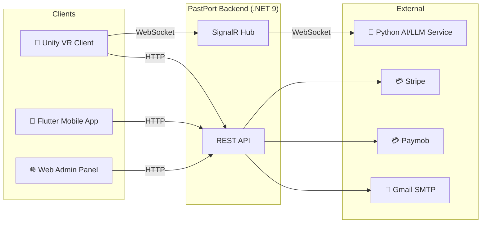
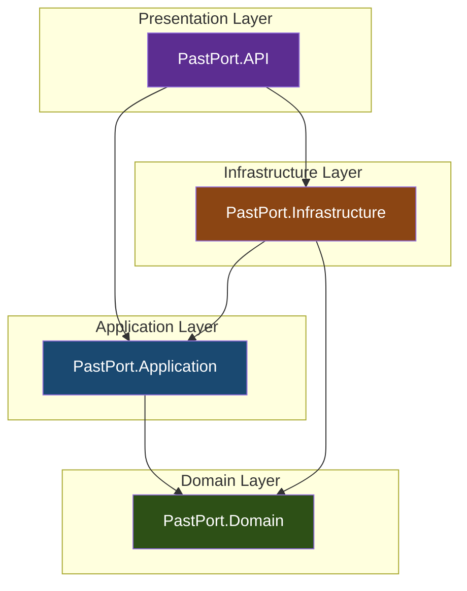
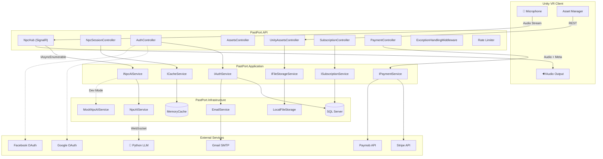
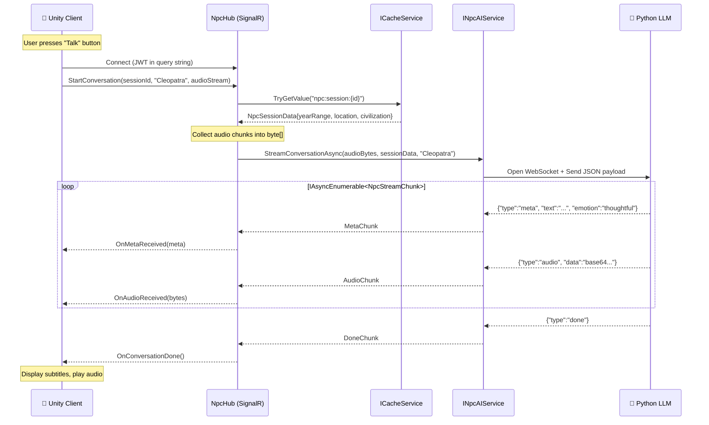
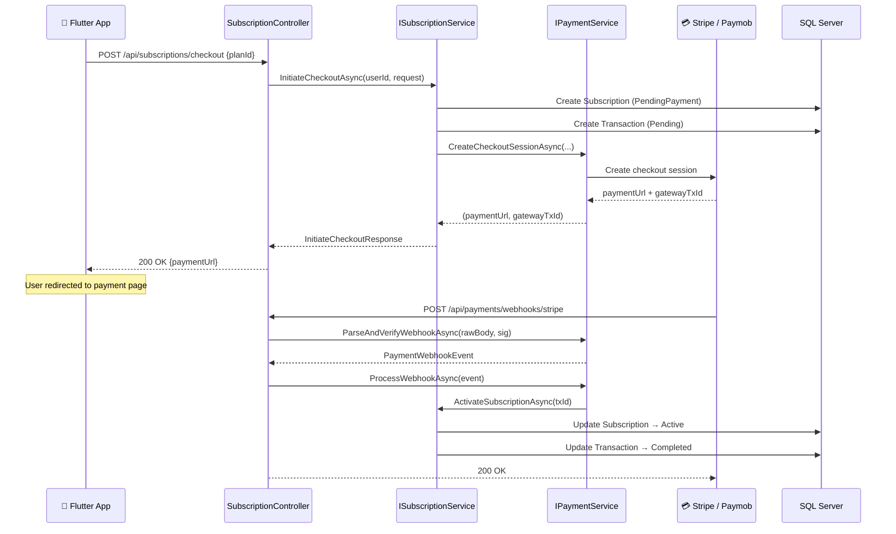
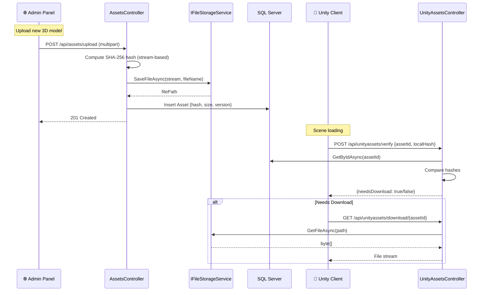
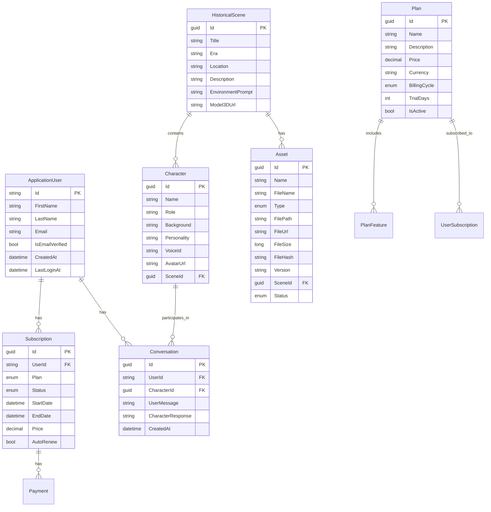
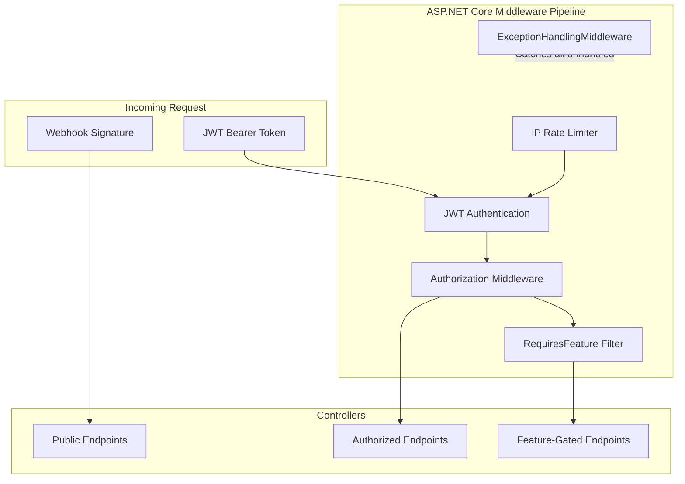

# PastPort Architecture Documentation

> This document provides a comprehensive overview of the PastPort backend system architecture, design patterns, data flow, and infrastructure decisions.

---

## Table of Contents

- [System Overview](#system-overview)
- [Architecture Style](#architecture-style)
- [Layer Breakdown](#layer-breakdown)
  - [PastPort.API (Presentation)](#pastportapi-presentation-layer)
  - [PastPort.Application (Business Logic)](#pastportapplication-business-logic-layer)
  - [PastPort.Domain (Core)](#pastportdomain-core-layer)
  - [PastPort.Infrastructure (Data & External Services)](#pastportinfrastructure-data--external-services)
- [High-Level System Diagram](#high-level-system-diagram)
- [Data Flow: NPC AI Conversation](#data-flow-npc-ai-conversation)
- [Data Flow: Subscription Checkout](#data-flow-subscription-checkout)
- [Data Flow: Asset Upload & Verification](#data-flow-asset-upload--verification)
- [Entity Relationship Model](#entity-relationship-model)
- [Security Architecture](#security-architecture)
- [Cross-Cutting Concerns](#cross-cutting-concerns)
- [Performance Design](#performance-design)
- [Scalability Considerations](#scalability-considerations)

---

## System Overview

PastPort is a Virtual Reality platform for immersive historical experiences. The backend serves three distinct client applications:



| Client    | Primary Use                                  | Protocol     |
| --------- | -------------------------------------------- | ------------ |
| Unity VR  | Real-time NPC voice interaction, asset sync  | SignalR + REST |
| Flutter   | Auth, session setup, subscriptions, profiles | REST         |
| Web Admin | Content management, asset uploads            | REST         |

---

## Architecture Style

The solution follows **Clean Architecture** (Robert C. Martin), also known as **Onion Architecture**, with four concentric layers:



### Dependency Rule

> Dependencies always point **inward**. The Domain layer has zero external dependencies. Application defines contracts (interfaces). Infrastructure implements them. API composes everything.

| Layer           | Depends On         | Never Depends On |
| --------------- | ------------------- | ----------------- |
| Domain          | *(nothing)*         | Application, API  |
| Application     | Domain              | Infrastructure, API |
| Infrastructure  | Domain, Application | API               |
| API             | Application, Infra  | *(top-level)*     |

---

## Layer Breakdown

### PastPort.API (Presentation Layer)

The entry point for all HTTP and WebSocket communication.

| Component                      | Responsibility                                                          |
| ------------------------------ | ----------------------------------------------------------------------- |
| **Controllers**                | Thin REST endpoints that delegate to Application services               |
| **NpcHub**                     | SignalR hub for bi-directional NPC audio streaming                      |
| **ExceptionHandlingMiddleware**| Catches unhandled exceptions, maps to structured JSON error responses   |
| **RequiresFeatureAttribute**   | Action filter that gates endpoints behind subscription feature slugs    |
| **ServiceCollectionExtensions**| Composition root: registers all DI services, DbContext, auth, SignalR  |
| **Program.cs**                 | Application bootstrap: Serilog, pipeline configuration, hub mapping    |

#### Controller Design Pattern

All controllers follow a **thin controller** pattern:
1. Validate `ModelState`
2. Extract user identity from JWT claims
3. Delegate to an `Application` layer service
4. Return appropriate HTTP status code

```csharp
[HttpPost("register")]
public async Task<IActionResult> Register([FromBody] RegisterRequestDto request)
{
    if (!ModelState.IsValid) return BadRequest(ModelState);
    var result = await authService.RegisterAsync(request);
    if (!result.Success) return BadRequest(result);
    return Ok(result);
}
```

---

### PastPort.Application (Business Logic Layer)

Defines the **contracts** (interfaces) and **data transfer objects** (DTOs) that the API and Infrastructure layers consume.

| Component          | Contents                                                              |
| ------------------ | --------------------------------------------------------------------- |
| **Interfaces/**    | `IAuthService`, `INpcAIService`, `IPaymentService`, `ICacheService`, etc. |
| **DTOs/**          | Request/Response objects for API communication                        |
| **Models/Npc/**    | Stream chunk types: `MetaChunk`, `AudioChunk`, `ErrorChunk`, `DoneChunk` |
| **Services/**      | Implementations of business logic (character service, etc.)           |

#### Key Interface: `INpcAIService`

```csharp
public interface INpcAIService
{
    IAsyncEnumerable<NpcStreamChunk> StreamConversationAsync(
        byte[] audioBytes,
        NpcSessionData sessionData,
        string roleOrName,
        CancellationToken cancellationToken = default);
}
```

This interface:
- Returns `IAsyncEnumerable<NpcStreamChunk>` for zero-buffer streaming
- Uses discriminated union-style chunks (`MetaChunk | AudioChunk | ErrorChunk | DoneChunk`)
- Never throws — errors are yielded as `ErrorChunk` so the hub can relay them to clients

---

### PastPort.Domain (Core Layer)

The innermost layer containing enterprise business rules.

| Component       | Contents                                                         |
| --------------- | ---------------------------------------------------------------- |
| **Entities/**   | `ApplicationUser`, `HistoricalScene`, `Character`, `Conversation`, `Asset`, `Plan`, `Subscription` |
| **Enums/**      | `AssetType`, `AssetStatus`, `BillingCycle`, `SubscriptionPlan`, `SubscriptionStatus` |
| **Constants/**  | `Roles` — `Admin`, `School`, `Museum`, `Enterprise`, `Individual` |
| **Interfaces/** | `IRepository<T>` — generic async CRUD contract                  |
| **Exceptions/** | `NotFoundException`, `ValidationException`                       |

#### Entity Relationships

```
ApplicationUser (IdentityUser)
├── Subscriptions[] → Subscription → Plan → PlanFeature[]
├── Conversations[] → Conversation → Character → HistoricalScene
```

#### Generic Repository Contract

```csharp
public interface IRepository<T> where T : class
{
    Task<T?> GetByIdAsync(Guid id);
    Task<IEnumerable<T>> GetAllAsync();
    Task<IEnumerable<T>> FindAsync(Expression<Func<T, bool>> predicate);
    Task<T> AddAsync(T entity);
    Task UpdateAsync(T entity);
    Task DeleteAsync(T entity);
    Task<bool> ExistsAsync(Guid id);
}
```

---

### PastPort.Infrastructure (Data & External Services)

Implements all interfaces defined in Application and Domain.

| Directory             | Implementation                                                       |
| --------------------- | -------------------------------------------------------------------- |
| **Data/**             | `ApplicationDbContext` (EF Core), Migrations                         |
| **Repositories/**     | Generic `Repository<T>`, `IAssetRepository` (with `GetAssetByNameAsync`) |
| **Services/**         | `CacheService` (wraps `IMemoryCache`)                                |
| **ExternalServices/** | AI, Email, Payment, Storage integrations                             |

#### External Service Breakdown

| Service             | Technology                | Purpose                                     |
| ------------------- | ------------------------- | ------------------------------------------- |
| `NpcAIService`      | `ClientWebSocket`         | Streams audio + context to Python LLM       |
| `MockNpcAIService`  | In-memory                 | Simulates AI responses for local development |
| `EmailService`      | SMTP (System.Net.Mail)    | Verification codes, password reset emails   |
| `StripePaymentAdapter` | Stripe .NET SDK        | Checkout sessions, webhook parsing          |
| `PaymobPaymentAdapter` | HTTP + HMAC-SHA512     | Egypt-specific payment processing           |
| `LocalFileStorageService` | File system          | Asset file persistence                      |

---

## High-Level System Diagram



---

## Data Flow: NPC AI Conversation

The most architecturally significant flow in the system — a real-time, bi-directional voice conversation between a Unity VR user and an AI-powered historical character.



### Key Design Decisions

1. **`IAsyncEnumerable` over buffering** — Chunks are relayed to Unity as they arrive from the LLM, eliminating the need to buffer the entire response.
2. **Error-as-data pattern** — `NpcAIService` yields `ErrorChunk` instead of throwing, keeping the SignalR pipeline stable.
3. **Mock switchability** — `appsettings.json` controls whether the real AI service or `MockNpcAIService` is used.

---

## Data Flow: Subscription Checkout



---

## Data Flow: Asset Upload & Verification



---

## Entity Relationship Model



---

## Security Architecture



### Security Measures

| Layer                | Mechanism                                                                 |
| -------------------- | ------------------------------------------------------------------------- |
| **Transport**        | HTTPS enforced in production                                              |
| **Authentication**   | JWT Bearer with configurable expiry + refresh token rotation              |
| **Authorization**    | Role-based (`Admin`, `School`, `Museum`, `Enterprise`, `Individual`)      |
| **Feature Gating**   | `[RequiresFeature("slug")]` → returns HTTP 402 if plan lacks the feature |
| **Webhook Security** | Stripe: `Stripe-Signature` header validation. Paymob: HMAC-SHA512       |
| **Rate Limiting**    | IP-based, 10 req/min on `/api/npc/session/start`                        |
| **Error Masking**    | `ExceptionHandlingMiddleware` converts exceptions to safe JSON responses |
| **File Integrity**   | SHA-256 hash on upload, verified by Unity clients before use             |
| **Anti-Enumeration** | `POST /forgot-password` always returns 200 regardless of email existence |

---

## Cross-Cutting Concerns

### Logging

- **Library:** Serilog with console and file sinks
- **Structured logging** with semantic properties (`SessionId`, `AssetId`, etc.)
- Microsoft.* logs suppressed to `Warning` level

### Exception Handling

The `ExceptionHandlingMiddleware` uses pattern matching to map exceptions to HTTP status codes:

| Exception Type                | HTTP Code | Response                                    |
| ----------------------------- | --------- | ------------------------------------------- |
| `UnauthorizedAccessException` | 401       | "Unauthorized access"                        |
| `NotFoundException`           | 404       | Exception message preserved                  |
| `ValidationException`         | 400       | Exception message preserved                  |
| `ArgumentException`           | 400       | "Invalid request parameters"                |
| `InvalidOperationException`   | 400       | "The operation could not be completed"       |
| All others                    | 500       | "An error occurred while processing..."      |

### Dependency Injection

All services are registered in `ServiceCollectionExtensions.cs` — the **composition root**:

- **Scoped:** Repositories, DbContext, application services
- **Singleton:** Mapster configuration, rate limiting
- **Transient:** Email service

---

## Performance Design

| Technique                           | Where Applied                                      | Impact                              |
| ----------------------------------- | -------------------------------------------------- | ----------------------------------- |
| **`IAsyncEnumerable` streaming**    | NpcHub → NpcAIService → Python LLM                | Zero-buffer audio relay             |
| **Stream-based SHA-256**            | `AssetsController.UploadAsset`                     | No full file buffering in memory    |
| **Database-level filtering**        | `UnityAssetsController.SearchAsset`                | Uses `WHERE` instead of `GetAll()` |
| **Cache-first session lookup**      | `NpcSessionController` + `NpcHub`                  | Sub-millisecond session validation  |
| **Scoped services**                 | All controllers and services                       | Enables horizontal scaling          |

---

## Scalability Considerations

| Concern                | Current Design                        | Scale-Out Path                                   |
| ---------------------- | ------------------------------------- | ------------------------------------------------ |
| **State**              | In-memory cache (`IMemoryCache`)      | Redis with `IDistributedCache`                   |
| **SignalR**            | Single-server                         | Azure SignalR Service or Redis backplane          |
| **File Storage**       | Local filesystem                      | Azure Blob Storage / AWS S3                      |
| **Database**           | Single SQL Server instance            | Read replicas, connection pooling, Azure SQL     |
| **AI Service**         | Single WebSocket endpoint             | Load-balanced Python service behind API gateway  |
| **Rate Limiting**      | In-memory IP tracking                 | Distributed rate limiting with Redis             |
