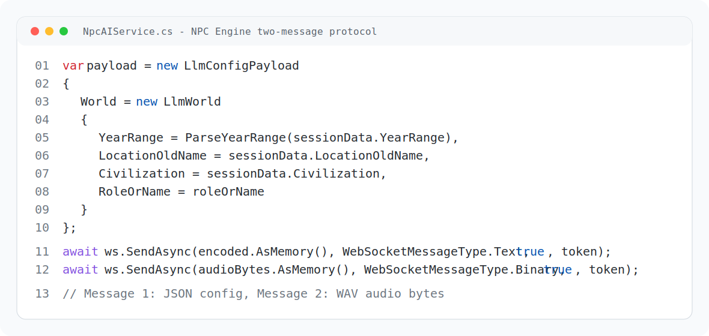
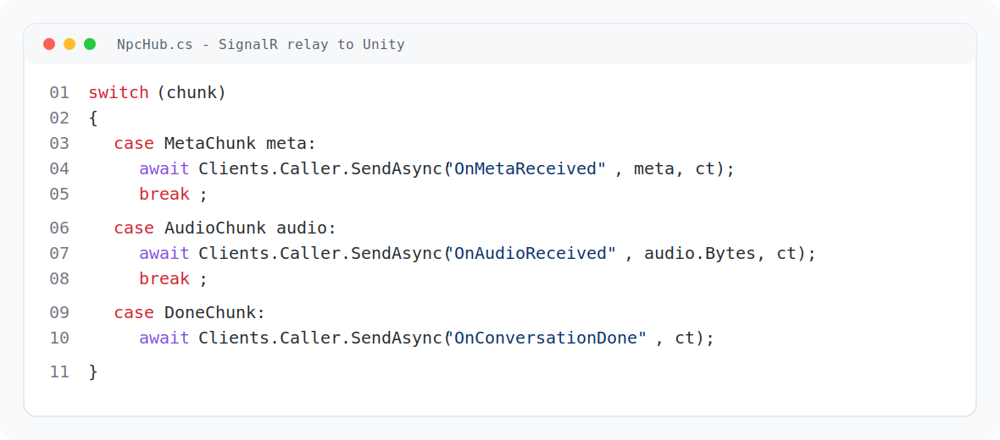
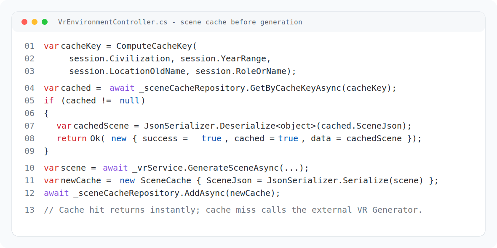
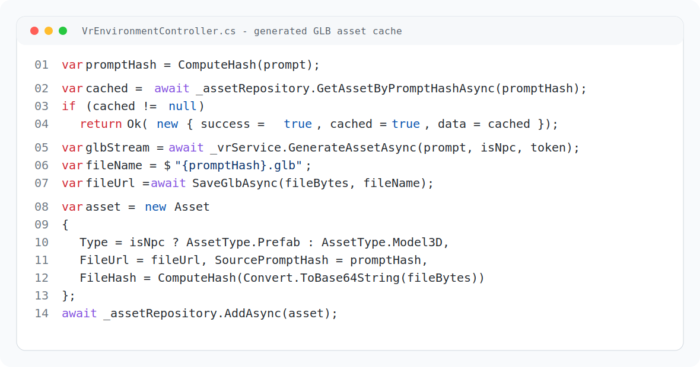

# Backend Chapter

## 1. Introduction

The backend of PastPort is responsible for managing the core business logic of the platform, securing user access, storing application data, handling payments, managing 3D assets, and integrating with external AI services used for VR scene generation and real-time NPC voice interaction.

The backend was developed using ASP.NET Core and follows a layered architecture that separates API endpoints, application contracts, domain models, infrastructure services, and external integrations. This structure improves maintainability, testability, and scalability.

PastPort's backend acts as the central communication layer between:

- Flutter mobile application.
- Unity VR client.
- SQL database.
- Local file storage.
- NPC Engine.
- VR Generator service.
- Payment provider.

## 2. Backend Responsibilities

The backend provides the following responsibilities:

- User authentication and account management.
- JWT-based authorization.
- Email verification and password reset.
- Subscription and payment handling.
- Historical scene and NPC character management.
- Real-time NPC voice communication through SignalR.
- VR scene generation session management.
- Generated 3D asset caching and delivery.
- File upload, storage, download, and integrity checking.
- Caching for expensive AI-generated results.
- Error handling, logging, and rate limiting.

## 3. Technology Stack

| Layer | Technology |
|---|---|
| Backend Framework | ASP.NET Core |
| Language | C# |
| Database ORM | Entity Framework Core |
| Database | SQL Server |
| Authentication | JWT Bearer Authentication |
| Real-Time Communication | SignalR |
| File Storage | Local server storage under `wwwroot/uploads` |
| AI Integration | WebSocket and HTTP APIs |
| Testing | xUnit, Moq, FluentAssertions |
| Logging | Serilog / ASP.NET Core Logging |

## 4. System Architecture

The backend follows a layered architecture:

```text
PastPort.API
  Controllers, SignalR hubs, middleware, application startup

PastPort.Application
  Interfaces, DTOs, application models, service contracts

PastPort.Domain
  Entities, enums, repository interfaces, domain models

PastPort.Infrastructure
  Database context, repositories, identity services, file storage,
  AI integrations, payment services

PastPort.Tests
  Unit tests for services, controllers, cache, and NPC streaming models
```

This separation keeps each layer focused on a specific responsibility. The API layer receives requests, the application layer defines contracts, the domain layer represents business entities, and the infrastructure layer implements external services and persistence.

## 5. Main Backend Modules

### 5.1 Authentication Module

The authentication module manages secure access to the system.

Main features:

- User registration.
- Login using email and password.
- JWT access token generation.
- Refresh token generation.
- Logout.
- Email verification using verification codes.
- Forgot-password and reset-password workflows.
- External authentication support for Google, Facebook, and Apple.

The authentication system protects sensitive endpoints and ensures that only authorized users can access protected resources.

### 5.2 User Management Module

The user management module allows authenticated users to manage their accounts.

Main features:

- View profile.
- Update profile information.
- Delete account.
- View user statistics.

### 5.3 Subscription and Payment Module

The payment module manages user subscriptions and payment operations.

Main features:

- Retrieve available subscription plans.
- View the current user's subscription.
- Start checkout.
- Upgrade or downgrade subscription plans.
- Cancel subscription.
- Check feature access.
- Store transactions and invoices.
- Integrate with PayPal.
- Process payment webhooks.

This module supports monetization and feature gating inside the application.

### 5.4 Historical Scene Management Module

This module manages manually stored historical scenes.

Main features:

- Create historical scenes.
- Retrieve all scenes.
- Retrieve a specific scene.
- Update scene details.
- Delete scenes.

A historical scene can include:

- Title.
- Era.
- Location.
- Description.
- Environment prompt.
- 3D model URL.

### 5.5 NPC Character Management Module

This module manages historical characters used inside VR experiences.

Main features:

- Create NPC characters.
- Retrieve NPC characters.
- Update NPC character information.
- Delete NPC characters.

Each NPC character can include:

- Name.
- Historical role.
- Background.
- Personality.
- Voice ID.
- Avatar URL.
- Related scene ID.

## 6. AI NPC Voice Interaction

The AI NPC feature allows Unity VR users to speak with historical characters in real time.

### 6.1 NPC Session Creation

Before Unity starts a voice conversation, a session must be created through:

```http
POST /api/npc/session/start
```

The request contains the historical context:

```json
{
  "yearRange": "300 BC - 30 BC",
  "locationOldName": "Alexandria",
  "civilization": "Ptolemaic Egypt"
}
```

The backend stores this data temporarily and returns a `sessionId`. Unity later uses this `sessionId` when communicating with the SignalR hub.

### 6.2 SignalR NPC Hub

Unity connects to:

```text
/npcHub
```

The main method used by Unity is:

```text
StartConversation(sessionId, roleOrName, audioStream)
```

The hub validates the session, receives audio from Unity, sends it to the NPC AI service, and relays the AI response back to Unity.

### 6.3 NPC Engine Protocol

The backend communicates with the external NPC Engine through WebSocket. The updated protocol sends two messages in order:

1. JSON world configuration.
2. WAV audio bytes.

The NPC Engine then returns:

1. Metadata JSON containing text, emotion, and selected year.
2. Generated WAV audio bytes.
3. Done message.



### 6.4 NPC Response Events

The backend sends the following SignalR events to Unity:

| Event | Description |
|---|---|
| `OnMetaReceived` | Sends NPC text response, emotion, and selected year |
| `OnAudioReceived` | Sends generated NPC voice audio bytes |
| `OnConversationDone` | Indicates that the NPC response is complete |
| `OnSessionError` | Sends error details to Unity |



### 6.5 NPC Error Handling

The system handles errors without crashing the SignalR connection. Possible error cases include:

- Missing or expired session.
- Empty audio payload.
- NPC Engine connection failure.
- Speech-to-text failure.
- LLM timeout.
- TTS timeout.
- Malformed response from the NPC Engine.

## 7. VR Generative Scene System

The VR Generative Scene system allows the application to create historical VR environments dynamically.

### 7.1 VR Session Creation

Flutter starts the VR flow by creating a session:

```http
POST /api/VrEnvironment/session
```

The request contains:

```json
{
  "civilization": "Ancient Egypt",
  "yearRange": "2550 BC - 2580 BC",
  "locationOldName": "Ineb-Hedj",
  "roleOrName": "Pharaoh Khafre"
}
```

The backend stores the VR session in the database and returns a `sessionId`. The session expires after 4 hours.

### 7.2 Scene Retrieval

Unity retrieves the generated scene using:

```http
GET /api/VrEnvironment/scene/{sessionId}
```

The backend performs the following steps:

1. Loads the session from the database.
2. Checks that the session has not expired.
3. Computes a cache key based on civilization, year range, location, and role.
4. Checks the scene cache.
5. If cached, returns the cached scene.
6. If not cached, calls the external VR Generator.
7. Stores the generated scene in cache.
8. Returns the generated scene to Unity.



### 7.3 Generated Scene Structure

The generated scene response contains:

- Scene type.
- Time of day.
- Weather.
- Atmosphere.
- Selected year.
- World context.
- Structures.
- Props.
- Ground details.
- Vegetation.
- NPCs.
- Lighting configuration.
- Skybox configuration.
- Historical notes.

This allows Unity to reconstruct the generated historical environment.

## 8. Generative 3D Asset Pipeline

After receiving the scene data, Unity requests 3D assets for each scene object.

### 8.1 Asset Request

Unity calls:

```http
GET /api/VrEnvironment/asset?prompt={prompt}&isNpc={true_or_false}
```

The backend performs the following steps:

1. Computes a SHA-256 hash from the prompt.
2. Checks if an asset already exists with the same prompt hash.
3. If cached, returns the existing asset data.
4. If not cached, calls the external VR Generator.
5. Receives a generated `.glb` stream.
6. Stores the `.glb` file in local storage.
7. Saves asset metadata in the database.
8. Returns `fileUrl`, `assetId`, and `fileName` to Unity.



### 8.2 Generated Asset Format

Generated VR assets are stored as:

```text
.glb
```

This format is suitable for Unity and common 3D workflows.

## 9. Asset Management and Delivery

The backend supports both manually uploaded assets and AI-generated assets.

### 9.1 Asset Management Features

- Upload assets.
- Store asset metadata.
- Link assets to scenes.
- Download assets.
- Delete assets by Admin users.
- Store file hash.
- Store file size.
- Store file version.
- Store asset status.

### 9.2 Supported Asset Extensions

| Category | Extensions |
|---|---|
| 3D Models | `.glb`, `.gltf`, `.obj`, `.fbx` |
| Images | `.jpg`, `.jpeg`, `.png`, `.gif`, `.webp` |
| Audio | `.mp3`, `.wav`, `.ogg` |
| Documents | `.pdf` |

### 9.3 Unity Asset Endpoints

Unity can use the following asset endpoints:

| Endpoint | Purpose |
|---|---|
| `GET /api/unityassets/search?name={name}` | Search for an asset by name |
| `GET /api/unityassets/scene/{sceneId}` | Retrieve all assets for a scene |
| `GET /api/unityassets/download/{assetId}` | Download an asset file |
| `POST /api/unityassets/verify` | Verify asset hash and decide if download is needed |

Unity can read asset and scene cache results, but it cannot directly edit or delete backend cache data. Cache records are created or updated only by backend logic.

## 10. File Storage System

The backend stores uploaded and generated files locally under:

```text
wwwroot/uploads
```

Main file storage features:

- Unique file name generation.
- File upload.
- File deletion.
- File existence checks.
- File size lookup.
- Secure path validation.
- Protection against path traversal.
- Stream-based file access for large files.

The storage service helps serve both manually uploaded assets and generated GLB files.

## 11. Caching Strategy

Caching is important because AI generation can be slow and expensive.

### 11.1 NPC Session Cache

NPC conversation context is stored temporarily using memory cache.

Cache key format:

```text
npc:session:{sessionId}
```

### 11.2 VR Session Storage

VR sessions are stored in the database and expire after 4 hours.

### 11.3 Scene Cache

Generated scenes are cached using a SHA-256 key based on:

- Civilization.
- Year range.
- Historical location.
- Optional role or NPC name.

Scene cache lifetime:

```text
7 days
```

### 11.4 Asset Cache

Generated assets are cached using a SHA-256 hash of the asset prompt. This prevents generating the same asset more than once.

## 12. Security

The backend applies several security mechanisms:

- JWT authentication.
- Role-based authorization.
- Admin-only delete operations.
- Rate limiting for NPC session creation.
- Secure file access validation.
- SHA-256 hashing for file integrity.
- Global exception handling.
- Path traversal protection.
- File size checks for large files.
- Protected asset download endpoints.

## 13. Error Handling and Logging

The backend includes structured error handling and logging.

Main error handling techniques:

- Global exception middleware.
- Try/catch blocks around external AI service calls.
- Safe error responses for Unity and Flutter.
- Logging for failed AI generation, WebSocket errors, upload failures, and cache behavior.

This improves debugging and provides safer API responses.

## 14. Testing

The backend includes automated tests for important components.

Covered areas include:

- Controller behavior.
- Cache service behavior.
- NPC stream chunk models.
- NPC AI response parsing.
- SignalR hub behavior.
- Mock NPC AI service behavior.

Latest verification:

```text
90 tests passed
```

The project also builds successfully.

## 15. Backend API Summary

| Module | Example Endpoints |
|---|---|
| Authentication | `/api/auth/register`, `/api/auth/login`, `/api/auth/refresh-token` |
| Users | `/api/users/profile`, `/api/users/stats` |
| Scenes | `/api/scenes` |
| Characters | `/api/characters` |
| NPC Sessions | `/api/npc/session/start`, `/api/npc/session/{sessionId}` |
| NPC SignalR Hub | `/npcHub` |
| VR Generation | `/api/VrEnvironment/session`, `/api/VrEnvironment/scene/{sessionId}`, `/api/VrEnvironment/asset` |
| Assets | `/api/assets/upload`, `/api/assets/download/{fileName}` |
| Unity Assets | `/api/unityassets/search`, `/api/unityassets/verify` |
| Subscriptions | `/api/subscriptions/plans`, `/api/subscriptions/me` |
| Payments | `/api/payments/transactions`, `/api/payments/invoices` |

## 16. Backend Flow Summary

### NPC Flow

1. Flutter creates an NPC session.
2. Backend stores historical context in cache.
3. Unity connects to SignalR.
4. Unity sends voice audio.
5. Backend validates the session.
6. Backend sends JSON config and WAV audio to NPC Engine.
7. NPC Engine performs STT, LLM, and TTS.
8. Backend relays text, emotion, year, and audio to Unity.

### VR Generative Flow

1. Flutter creates a VR session.
2. Backend stores the session in the database.
3. Unity requests the scene.
4. Backend checks scene cache.
5. Backend generates the scene if it is not cached.
6. Unity requests assets for scene objects.
7. Backend checks asset cache.
8. Backend generates missing `.glb` assets.
9. Unity downloads and renders the scene.

## 17. Conclusion

The PastPort backend provides the main infrastructure required for an AI-powered VR historical experience. It combines secure user management, real-time communication, AI service integration, generated scene and asset caching, file delivery, payments, and testing into a unified backend system.

This backend enables Unity and Flutter clients to deliver an interactive historical experience where users can explore generated VR environments and communicate with AI-powered historical NPCs through voice.
