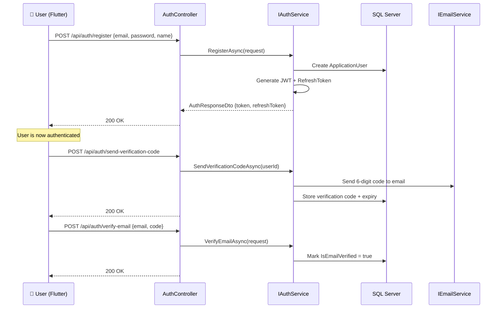
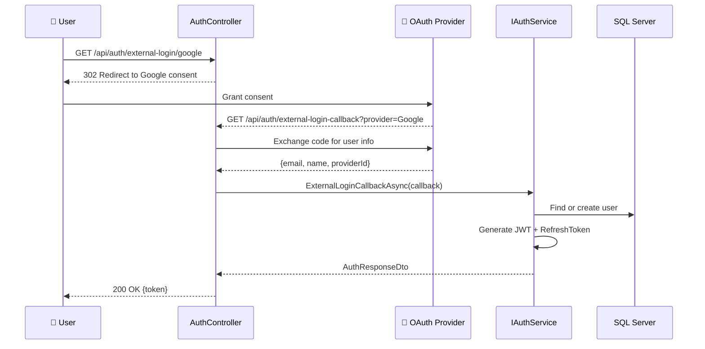
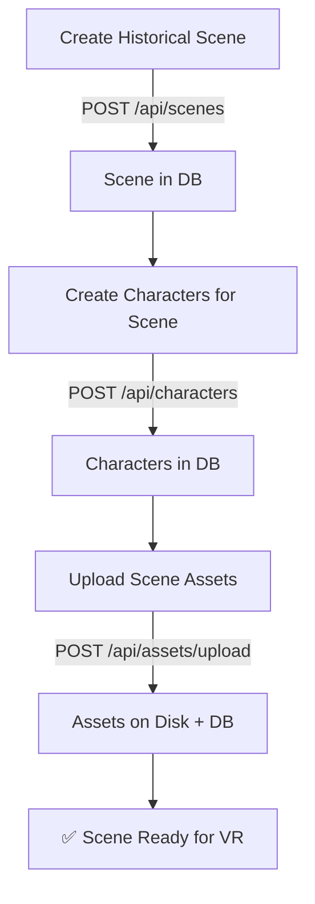
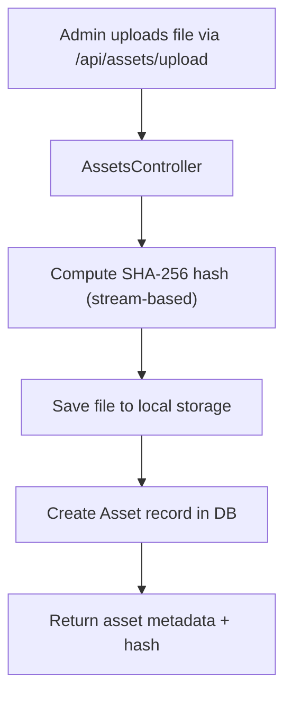
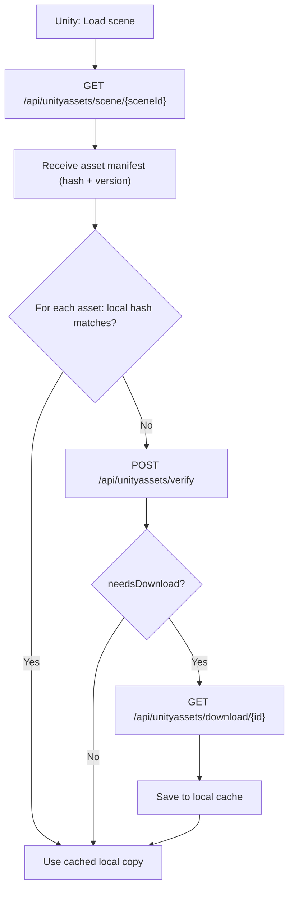
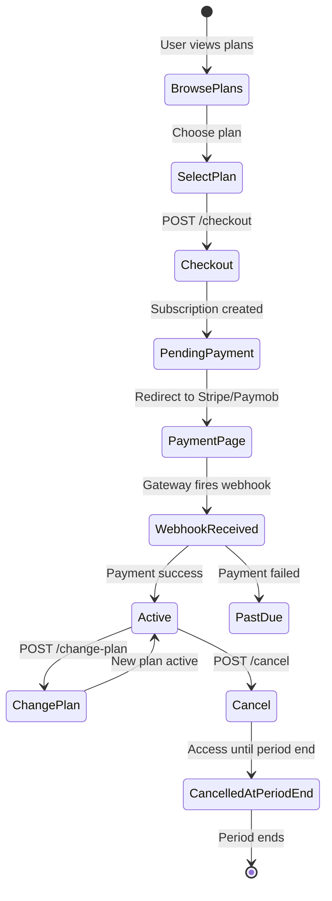
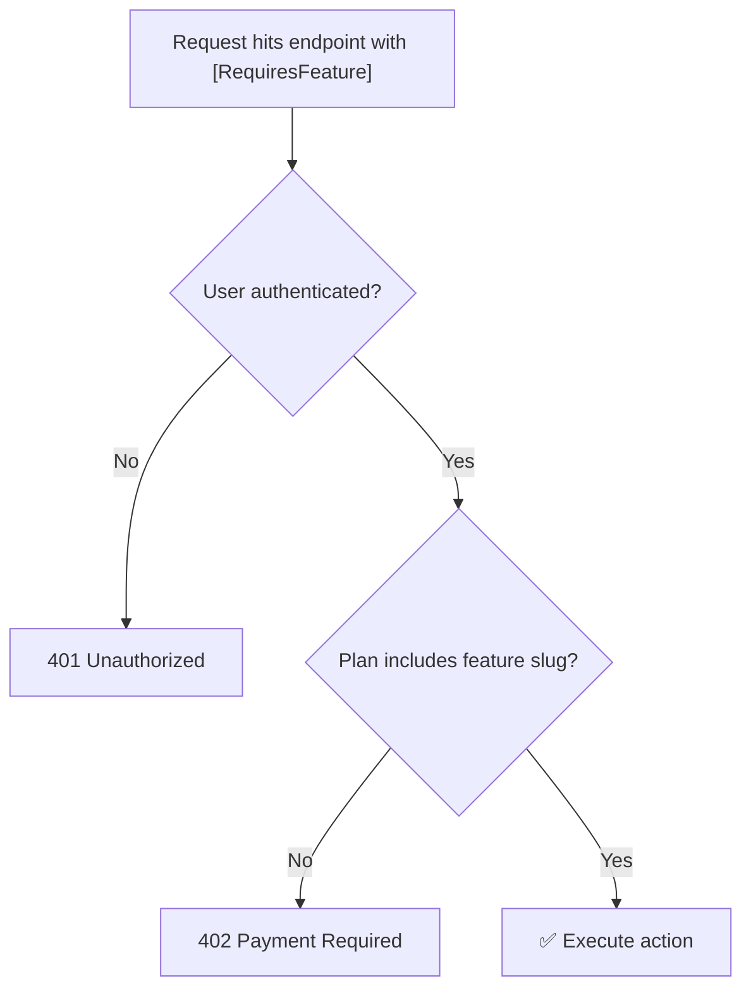
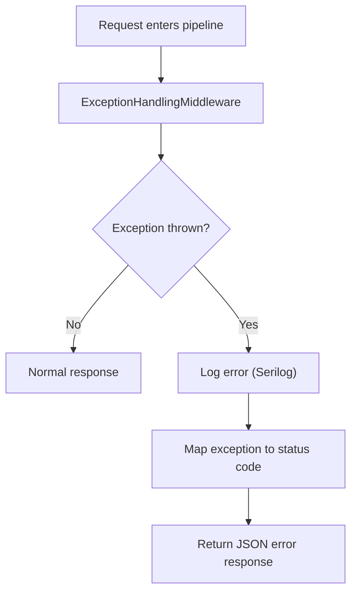

# PastPort Workflow Documentation

> This document describes the end-to-end user journeys, internal processing flows, and operational workflows that power the PastPort platform.

---

## Table of Contents

- [1. User Onboarding](#1-user-onboarding)
- [2. Scene & Character Setup](#2-scene--character-setup)
- [3. NPC Conversation Session Lifecycle](#3-npc-conversation-session-lifecycle)
- [4. Asset Pipeline](#4-asset-pipeline)
- [5. Subscription & Payment Flow](#5-subscription--payment-flow)
- [6. Feature Gating](#6-feature-gating)
- [7. Error Handling & Recovery](#7-error-handling--recovery)

---

## 1. User Onboarding

### Standard Registration Flow



### OAuth Login Flow (Google / Facebook / Apple)



### Password Reset Flow

1. User calls `POST /api/auth/forgot-password` with their email
2. Backend **always returns 200** (prevents email enumeration)
3. If the email exists, a reset code is sent via SMTP
4. User calls `POST /api/auth/verify-reset-code` with the code
5. User calls `POST /api/auth/reset-password` with the verified code + new password

---

## 2. Scene & Character Setup

### Admin Content Creation

The admin (or authorized user) sets up the historical world:



**Scene data includes:**
- Title, era, location
- `EnvironmentPrompt` — fed to the LLM to set historical context
- `Model3DUrl` — reference to the 3D scene model

**Character data includes:**
- Name, role, background, personality traits
- `VoiceId` — used by the AI voice synthesis
- `AvatarUrl` — visual representation in VR

---

## 3. NPC Conversation Session Lifecycle

The NPC conversation is the core feature of PastPort. It involves coordination between four systems.

### Phase 1: Session Creation (REST)

```
Flutter App → POST /api/npc/session/start
              {yearRange, locationOldName, civilization}
           ← 201 Created {sessionId, expiresAt}
```

- The `NpcSessionController` generates a unique session ID
- Session metadata (`NpcSessionData`) is cached with a 2-hour TTL
- The cache key is namespaced: `npc:session:{sessionId}`

### Phase 2: Real-Time Conversation (SignalR)

```
Unity VR → Connect to /npcHub (JWT auth)
         → Invoke StartConversation(sessionId, "Cleopatra", audioStream)
```

**Hub processing:**

1. **Validate session** — Look up `npc:session:{id}` in cache
2. **Collect audio** — Drain the `IAsyncEnumerable<byte[]>` into a single `byte[]`
3. **Call AI service** — `INpcAIService.StreamConversationAsync(...)` returns `IAsyncEnumerable<NpcStreamChunk>`
4. **Stream to client** — For each chunk:
   - `MetaChunk` → `Clients.Caller.SendAsync("OnMetaReceived", ...)`
   - `AudioChunk` → `Clients.Caller.SendAsync("OnAudioReceived", ...)`
   - `ErrorChunk` → `Clients.Caller.SendAsync("OnSessionError", ...)`
   - `DoneChunk` → `Clients.Caller.SendAsync("OnConversationDone")`

### Phase 3: Session Termination

Sessions end in one of three ways:

| Trigger          | What Happens                                       |
| ---------------- | -------------------------------------------------- |
| AI sends `done`  | Hub fires `OnConversationDone`, session stays alive |
| Client calls `EndSession` | Hub removes session from cache            |
| TTL expires      | Cache evicts session automatically (2 hours)       |

### AI Service Architecture

The system supports two implementations of `INpcAIService`:

| Implementation      | When Used       | Behavior                                          |
| -------------------- | --------------- | ------------------------------------------------- |
| `NpcAIService`       | Production      | Opens `ClientWebSocket` to Python LLM             |
| `MockNpcAIService`   | Development     | Returns pre-recorded responses for testing         |

Switching is controlled by configuration in `appsettings.json` and the DI registration in `ServiceCollectionExtensions`.

---

## 4. Asset Pipeline

### Upload Flow



**Security notes:**
- SHA-256 is computed from the upload stream (no full buffering)
- The hash is stored in the database as the `FileHash` property
- Previous versions used MD5; SHA-256 is the current standard

### Unity Asset Sync Flow

When Unity loads a scene, it follows this verification protocol:



**Key endpoints:**
- `GET /api/unityassets/search?name=` — Find asset by name (`[AllowAnonymous]`)
- `GET /api/unityassets/scene/{sceneId}` — All assets for a scene (`[AllowAnonymous]`)
- `POST /api/unityassets/verify` — Hash comparison (`[AllowAnonymous]`)
- `GET /api/unityassets/download/{id}` — Binary download (`[Authorize]`)

---

## 5. Subscription & Payment Flow

### Checkout Journey



### Webhook Processing

```
Stripe → POST /api/payments/webhooks/stripe
         Header: Stripe-Signature

Paymob → POST /api/payments/webhooks/paymob?hmac={hmac}
```

Both webhook endpoints:
1. Read the raw request body (required for signature verification)
2. Verify the cryptographic signature
3. Parse into a normalized `PaymentWebhookEvent`
4. Delegate to `IPaymentService.ProcessWebhookAsync`
5. **Always return 200 quickly** to prevent gateway retries

---

## 6. Feature Gating

The `[RequiresFeature("slug")]` attribute provides subscription-based access control:



**Usage example in controllers:**
```csharp
[HttpGet("artifacts/hidden")]
[Authorize]
[RequiresFeature("ExploreSecrets")]
public IActionResult GetHiddenArtifacts() { ... }
```

**Frontend check:**
```
GET /api/subscriptions/features/ExploreSecrets
→ { "featureSlug": "ExploreSecrets", "hasAccess": true }
```

---

## 7. Error Handling & Recovery

### Global Exception Pipeline



### NPC-Specific Error Handling

| Error Scenario                | Behavior                                                    |
| ----------------------------- | ----------------------------------------------------------- |
| Invalid session ID            | `OnSessionError("Session not found or expired")`           |
| AI WebSocket connection fails | `ErrorChunk` yielded → `OnSessionError(message)`            |
| AI response timeout (120s)    | `CancellationToken` fires → stream terminates               |
| Client disconnects mid-stream | SignalR detects disconnect → `CancellationToken` propagates |

### Rate Limiting

NPC session creation is rate-limited to prevent abuse:

```json
{
  "Endpoint": "POST:/api/npc/session/start",
  "Period": "1m",
  "Limit": 10
}
```

Exceeding the limit returns `429 Too Many Requests`.
